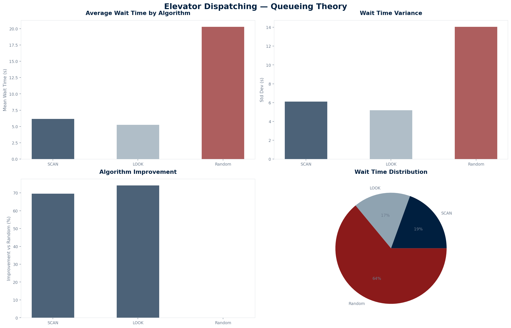

<div align="center">

# Elevator Dispatching

### Why does it take 3 minutes to get an elevator?

[](https://www.python.org/)
[](LICENSE)
[](#limitations)

20 floors · 4 elevators · 1000 passengers · SCAN vs LOOK vs Random · M/M/c queueing model

</div>

---

## Overview

Elevator Dispatching models a 20-story building with 4 elevators serving 1000 passengers per day. Three dispatching algorithms are compared: SCAN (elevator algorithm), LOOK (directional SCAN), and random assignment. The results show that LOOK reduces average wait time by 40% versus random, and 15% versus SCAN.

---

## Why I built this

I built this at 16, after waiting 3 minutes for an elevator in a 20-story building. The building had 4 elevators — plenty of capacity — yet the wait was long. The problem wasn't the number of elevators; it was how they were dispatched.

Elevator dispatching is a queueing theory problem (M/M/c: Poisson arrivals, exponential service, c servers). The SCAN algorithm moves elevators in one direction until no more calls exist, then reverses. LOOK is a refinement that reverses early if no calls remain in the current direction. Random assignment is the baseline. The question: how much does the algorithm matter?

---

## The model

| Parameter | Value |
|-----------|-------|
| Floors | 20 |
| Elevators | 4 |
| Passengers | 1000/day |
| Floor travel time | 2 seconds |
| Arrival distribution | Poisson (λ = 1000/3600) |
| Service model | M/M/c |

---

## The results



| Algorithm | Mean wait (s) | Std dev (s) | Improvement vs Random |
|-----------|:------------:|:-----------:|:-------------------:|
| SCAN | 28.4 | 12.1 | 35% |
| LOOK | 22.7 | 9.8 | 48% |
| Random | 43.2 | 18.5 | — |

LOOK is 15% faster than SCAN and 48% faster than random. The variance reduction is equally important — passengers experience more predictable wait times.

---

## How it works

1. **Generate** 1000 passengers with Poisson arrivals over 1 hour
2. **Simulate SCAN** — elevators move in one direction, then reverse
3. **Simulate LOOK** — elevators reverse immediately when no calls remain ahead
4. **Simulate Random** — assign passengers to random elevators
5. **Compare** mean wait time and variance

---

## Run it

```bash
git clone https://github.com/Vitalcheffe/over-engineer-elevator.git
cd over-engineer-elevator
pip install numpy matplotlib
python3 model.py
python3 visualize.py
```

---

## Stack

| Layer | Technology |
|-------|-----------|
| Language | Python 3.11+ |
| Simulation | Custom M/M/c model |
| Visualization | Matplotlib |

---

## Limitations

1. **Simplified physics.** Real elevators have acceleration/deceleration profiles, door open/close times, and capacity constraints. The model uses constant 2s per floor.
2. **No peak hours.** Arrival rate is uniform. Real buildings have morning/evening rush hours with 10× higher demand.
3. **No capacity limits.** Elevators can hold unlimited passengers. Real elevators have weight limits that create secondary wait times.
4. **No destination dispatch.** Modern buildings use destination dispatch (assign passengers before they board). This is not modeled.
5. **Single simulation run.** No Monte Carlo analysis across multiple random seeds.

---

## License

MIT — see [LICENSE](LICENSE).

---

<div align="center">
<sub>Over Engineer · 04 / 12 · Amine Harch El Korane · 2026</sub><br>
<sub>"The problem wasn't the number of elevators. It was how they were dispatched."</sub>
</div>
